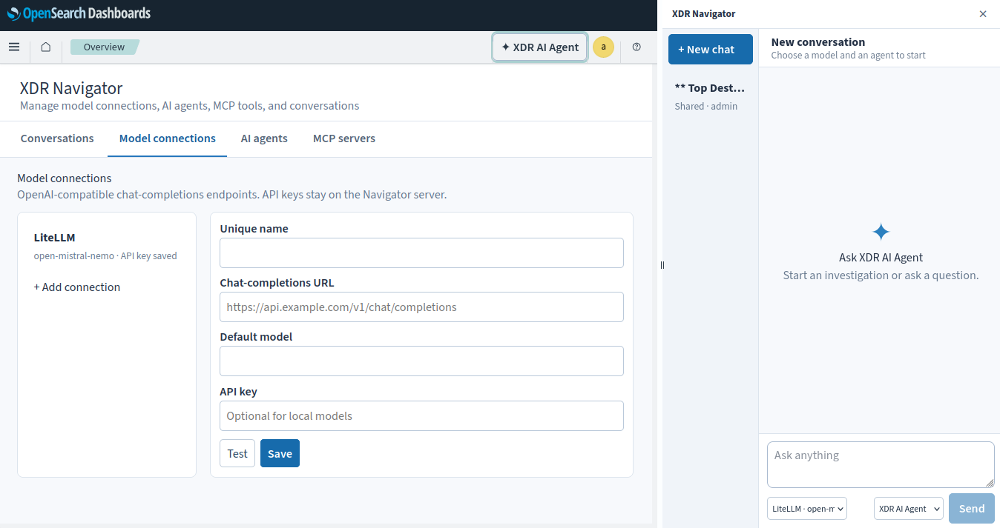

# XDR Navigator

Navigator is the XDR Security AI chat plugin for OpenSearch Dashboards. It registers a top-right chat panel that stays available while navigating Coordinator, Defense, Visualizer, and Navigator. The Navigator app manages conversations, OpenAI-compatible model connections, agents, and remote MCP servers.



## Configuration

Navigator requires a signed-in OpenSearch Security user. For a user to manage model connections, agents, MCP servers, and every conversation, create an OpenSearch Security role named `xdr_navigator_admin` and map the user to it. Navigator checks resolved Security roles and backend roles from the signed-in identity. Other signed-in users can create private conversations and read and continue shared conversations. Conversation owners and Navigator admins can change visibility or delete a conversation. Only the latest turn's author or a Navigator admin can edit or retry that turn.

Set `XDR_NAVIGATOR_ENCRYPTION_KEY` to a stable, secret value of at least 32 characters on every Dashboards instance. Navigator encrypts model API keys and MCP bearer tokens using AES-256-GCM. Back up this key securely: losing it makes saved credentials unreadable. The key is never stored in OpenSearch.

The bundled development stack under `opensearch/` disables Security and therefore cannot exercise Navigator's signed-user access rules. Use an authenticated Dashboards deployment to test private, shared, and administrator access.

## Model connections

Create a named model connection with a full OpenAI-compatible chat-completions URL, default model, and optional API key. Test sends a small prompt to the endpoint. Agents with MCP tools require a model that supports OpenAI-style tool calls.

## MCP servers

Navigator is an MCP client. A FastMCP container on the same Docker network as Dashboards can be configured with an endpoint such as `http://fastmcp:8000/mcp`; use its service name rather than `localhost`. Remote servers can use an HTTPS URL. Navigator supports Streamable HTTP and optional bearer tokens. Test discovery or save the connection; saving also discovers tools. Refresh its tools after the server changes, then select tools on an agent. Assigning a tool allows the agent to run it without a confirmation prompt. Navigator does not host an MCP server.

## Build

Build a separate ZIP for each exact Dashboards target version. The release bundle includes Navigator alongside the other XDR plugins.

```bash
npm run build -- --opensearch-dashboards-version 3.5.0
```

Set `OSD_ROOT` to a Dashboards source checkout of the exact target version. The build rejects a version mismatch, stages into a disposable copy, and does not edit the upstream checkout. This workspace currently has 3.6.0 source; a 3.8.0 build needs a separate 3.8.0 checkout.

## License

XDR Navigator is free software under [GNU AGPLv3](LICENSE), which requires sharing source code when distributed or when modified versions serve remote users.

- **Usage:** use, modify, redistribute, and sell it, including cloud hosting, while following the license.
- **Distribution:** share the complete source code with recipients, including your changes and build files, using a method permitted by AGPLv3.
- **Network use (§13):** if you run a modified version, prominently offer every remote user free access to its complete source code, even without distribution.
- **Copyleft:** keep covered modified versions under AGPLv3, preserve notices, and identify your changes. Dependencies retain their own licenses.
- **Warranty:** provided without warranty; liability is limited as specified in the license.

> Sharing source code with the required users is mandatory.
